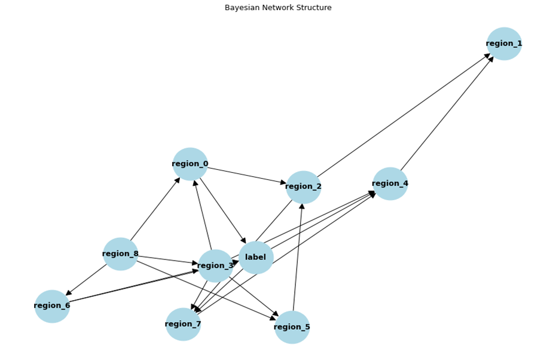
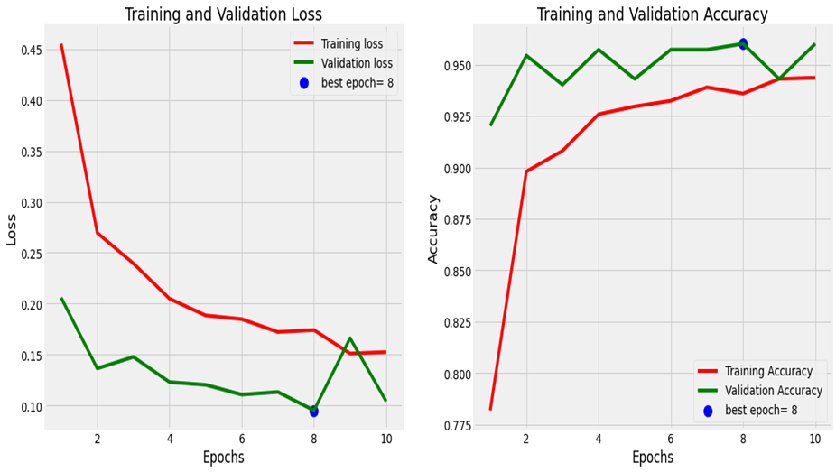
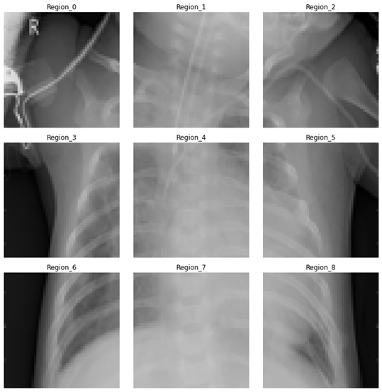
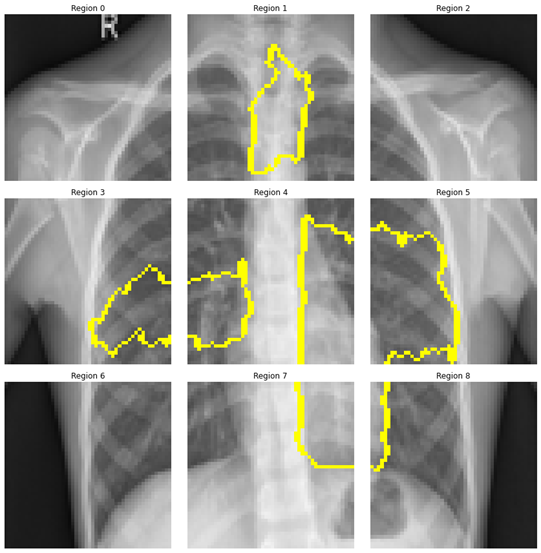
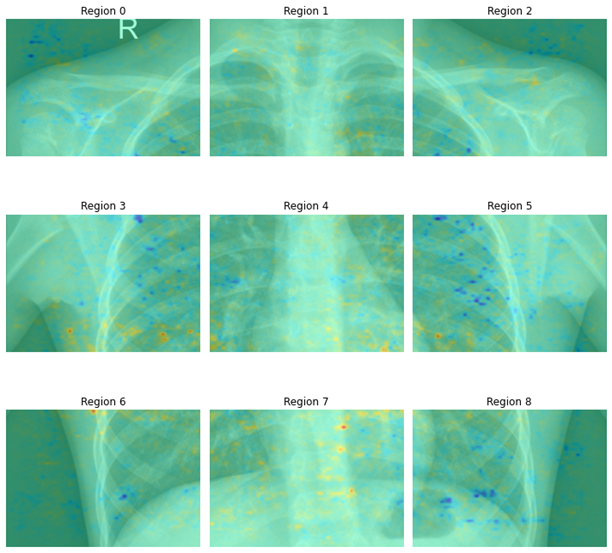
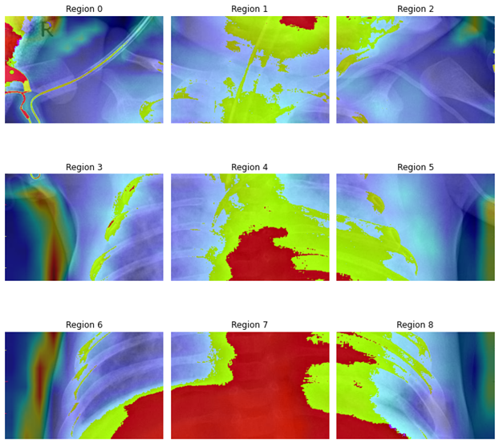

# 🧠 XAI-PGM-Counterfactuals: Explainable AI with Probabilistic Graphical Models

## 📌 Overview
This project presents a **novel Explainable AI (XAI) framework** integrating **Convolutional Neural Networks (CNNs)** and **Probabilistic Graphical Models (PGMs)** to provide **counterfactual explanations** for AI-driven medical diagnoses. The methodology focuses on **interpreting CNN predictions** in a **pneumonia classification task** using **chest X-ray images**, enhancing transparency in AI-driven decision-making.

### **🔹 Key Contributions**
✔ **CNN Feature Extraction:** Identifies **critical regions** in medical images.  
✔ **Prototype-Based Explainability:** Maps CNN **feature maps** to interpretable regions.  
✔ **Bayesian Networks:** Models relationships **between image regions**.  
✔ **Counterfactual Reasoning:** Evaluates **alternative explanations** for AI predictions.  
✔ **Comparison with LIME, SHAP, and Grad-CAM:** Benchmarks performance with existing XAI techniques.

---

## 📂 Dataset
- **Dataset Used:** [Chest X-ray Images (Pneumonia)](https://www.kaggle.com/datasets/paultimothymooney/chest-xray) 📸  
- **Task:** **Binary classification** (Normal vs. Pneumonia).
- **Feature Representation:** CNN-extracted features from **segmented lung regions**.

---

## 🚀 Methodology
### **1️⃣ CNN Feature Extraction**
- A **Convolutional Neural Network (CNN)** is trained on chest X-ray images.
- Extracted **feature maps** from the **last convolutional layer**.
- Divided images into a **3×3 grid** for **localized interpretability**.
- **Cosine similarity** is used to compare regions with **prototypes**.

### **2️⃣ Prototype-Based Explainability**
- **K-Means Clustering** applied to extracted features for **regional prototypes**.
- **Principal Component Analysis (PCA)** used for feature reduction.
- Similarity between new images and stored prototypes computed using **cosine similarity**.

### **3️⃣ Probabilistic Graphical Model (PGM) Construction**
- **Bayesian Network (BN)** created where **nodes represent image regions**.
- BN structure **learned using Hill Climb Search + K2 Score**.
- Conditional Probability Distributions (CPDs) estimated using **Maximum Likelihood Estimation**.

### **4️⃣ Counterfactual Generation & Analysis**
- **Region-wise feature similarities** in the Bayesian Network are **modified**.
- Evaluated how **changes in individual regions** affect CNN predictions.
- **Spearman’s Rank Correlation (ρ) and Weighted Spearman’s Rank Correlation (WFMρ)** used to **validate counterfactual results**.
- Counterfactuals compared with **LIME, SHAP, and Grad-CAM**.

## Basic Visuals

##  Bayesian Network Structure
This figure represents the **learned Bayesian Network (BN)** used for structured interpretability.

##  Training & Validation Loss Over Epochs
The **CNN model's training and validation performance**:

## Random Image divided into 9 regions

##  LIME Explanation – Feature Importance
LIME results showing **which image regions influenced the CNN decision**.

##  SHAP Explanation – Feature Attribution
SHAP heatmap indicating **the impact of each region on model prediction**.

##  Grad-CAM Heatmap – Model Focus
Grad-CAM visualization showing **which image regions the CNN focused on**.

---

## 📊 Results & Key Findings

### **Counterfactual Explanations for CNN Predictions**
| Changed Region | Change (From → To) | Original Prob | New Prob | Change in Prob |
|---------------|--------------------|--------------|----------|---------------|
| **Region 7**  | Medium → High      | 52.53%       | 84%      | +31.34%       |
| **Region 7**  | Medium → Low       | 52.53%       | 26%      | -26.84%       |
| **Region 4**  | Medium → Low       | 52.53%       | 29%      | -23.16%       |
| **Region 0**  | Low → Medium       | 52.53%       | 68%      | +15.50%       |
| **Region 4**  | Medium → High      | 52.53%       | 66%      | +13.72%       |

## 🔍 Comparison with Other Explainability Techniques

To validate the effectiveness of **PGM-based counterfactual explanations**, we compare the results with **three well-known XAI techniques**:
- **Grad-CAM** (Gradient-weighted Class Activation Mapping)
- **LIME** (Local Interpretable Model-agnostic Explanations)
- **SHAP** (Shapley Additive Explanations)

The evaluation is based on:
1. **Spearman’s Rank Correlation (ρ):** Measures how well-ranked importance scores align.
2. **Weighted Spearman’s Rank Correlation (WFMρ):** Adjusts for feature importance weighting.
3. **p-values:** Statistical significance of correlation results.

### **📊 Quantitative Evaluation**
| Method         | ρ (Spearman) | p-value (ρ) | WFMρ | p-value (WFMρ) |
|---------------|-------------|-------------|------|----------------|
| **LIME**      | 0.133       | 0.733       | 0.8973 | 0.001 |
| **SHAP**      | 0.300       | 0.4328      | 0.9568 | 0.0001 |
| **Grad-CAM**  | **0.7667**  | **0.0159**  | **0.9899** | **0.0001** |

### **🔹 Key Insights**
✔ **Grad-CAM exhibits the highest correlation (ρ = 0.7667) with PGM Counterfactuals**, confirming strong alignment in region importance.  
✔ **LIME shows weak correlation (ρ = 0.133), with a high p-value (0.733), indicating low statistical significance**.  
✔ **SHAP performs moderately well (ρ = 0.3), with WFMρ = 0.9568, but lower statistical significance compared to Grad-CAM**.  
✔ **Weighted correlations (WFMρ) are significantly higher for all methods, highlighting the impact of feature importance weighting**.  

---

## 📜 Final Thoughts
This comparison confirms that **PGM Counterfactuals provide a structured, probabilistic approach** to CNN explainability, aligning well with existing techniques while offering **causal interpretability**.

---

