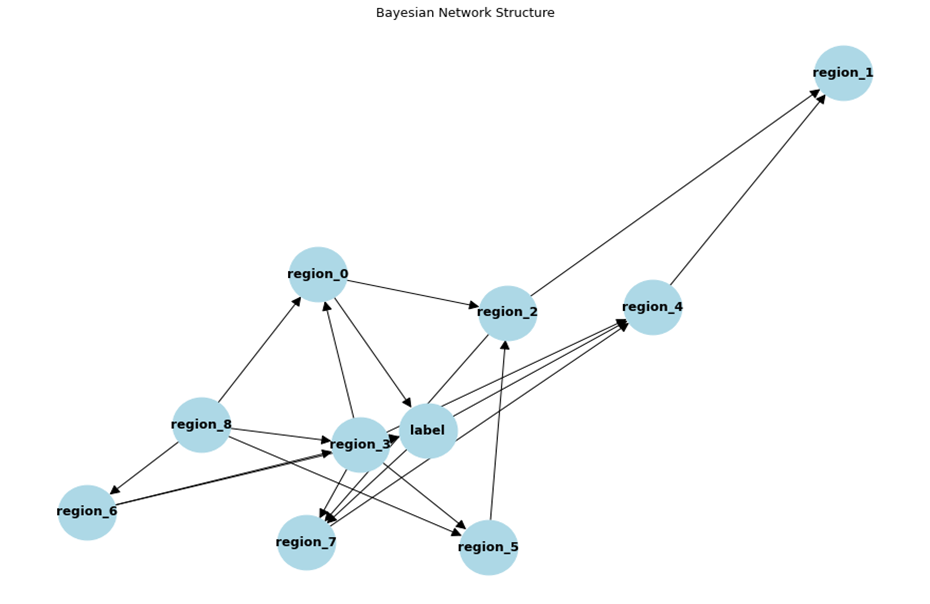
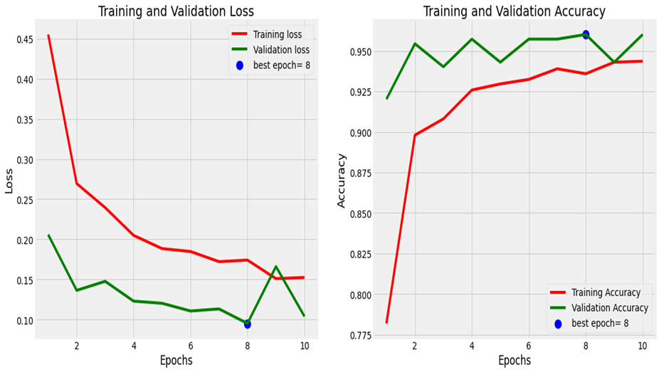
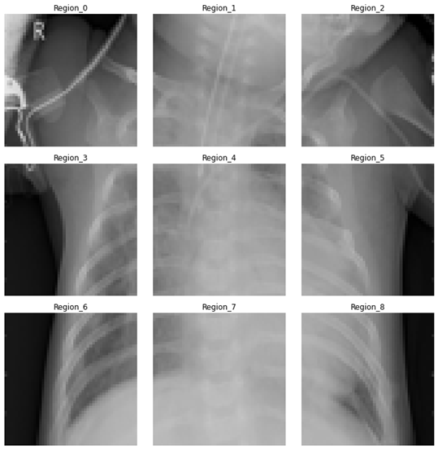
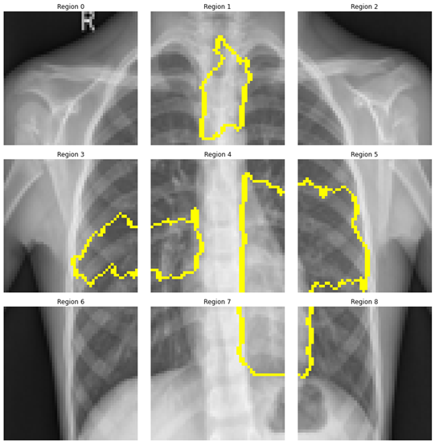
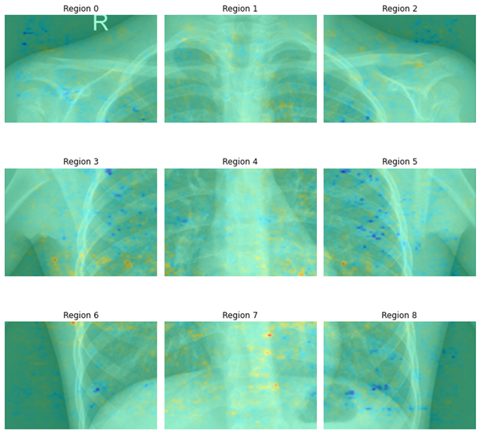
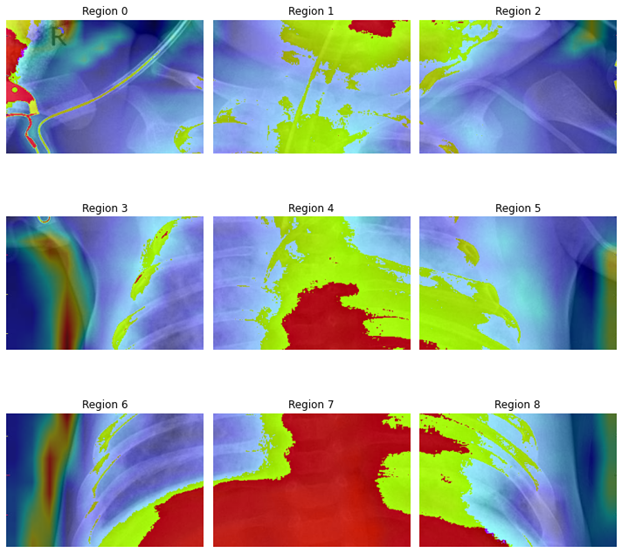

# XAI-PGM-Counterfactuals

A research-oriented Explainable AI project that combines a Convolutional Neural Network (CNN) with Probabilistic Graphical Models (PGMs) to generate region-level counterfactual explanations for chest X-ray pneumonia classification.

The project is designed to answer a specific interpretability question:

> Can CNN image features be transformed into structured probabilistic evidence so that counterfactual rules can be extracted and compared with standard XAI techniques?

---

## Why this project matters

Deep-learning models can achieve strong classification performance on medical-image tasks, but their predictions are difficult to interpret. This project explores a hybrid approach:

1. Train a CNN for binary chest X-ray classification.
2. Extract high-level feature maps from the last convolutional layer.
3. Divide each image into a 3 x 3 grid of spatial regions.
4. Represent each region using CNN-derived feature vectors.
5. Build regional prototypes with PCA and K-Means.
6. Convert region-prototype similarities into Bayesian Network variables.
7. Generate counterfactual explanations by changing region states and observing the effect on predicted class probability.
8. Compare the resulting region importance ranking with Grad-CAM, LIME, and SHAP.

This makes the project more than a standard image classifier: it investigates how deep visual features can be connected to probabilistic reasoning and explainability.

---

## Dataset

- **Dataset:** Chest X-Ray Images (Pneumonia), available on Kaggle.
- **Task:** Binary classification: Normal vs Pneumonia.
- **Input format:** Chest X-ray images resized to 150 x 150 pixels.
- **Interpretability representation:** Each image is divided into 9 spatial regions using a 3 x 3 grid. These are positional regions, not manually annotated medical or anatomical labels.

---

## Technical stack

- Python
- TensorFlow / Keras
- scikit-learn
- imbalanced-learn
- pgmpy
- NumPy / Pandas
- Matplotlib / Seaborn
- OpenCV
- scikit-image
- SHAP
- LIME
- NetworkX
- Netron

---

## Methodology

### 1. CNN classification model

A CNN is trained to classify chest X-ray images as Normal or Pneumonia.

Architecture summary:

- Conv2D + MaxPooling block
- Conv2D + MaxPooling block
- Conv2D + MaxPooling block
- Flatten
- Dense layer
- Dropout
- Sigmoid output layer

The trained CNN acts as the predictive model. The PGM component is used for explanation and counterfactual analysis, not as a replacement classifier.

### 2. Feature extraction

Feature maps are extracted from the last convolutional layer. This layer is used because it contains higher-level visual representations while still preserving spatial information.

Each image is divided into 9 regions:

| Region | Position |
|---|---|
| region_0 | upper-left |
| region_1 | upper-center |
| region_2 | upper-right |
| region_3 | middle-left |
| region_4 | center |
| region_5 | middle-right |
| region_6 | lower-left |
| region_7 | lower-center |
| region_8 | lower-right |

### 3. Prototype-based regional representation

For each region:

1. CNN features are extracted.
2. Global average pooling is applied.
3. PCA reduces dimensionality.
4. K-Means creates a regional prototype.
5. Cosine similarity measures how close a new image region is to the learned prototype.

The resulting similarity scores become the basis for the Bayesian Network variables.

### 4. Bayesian Network construction

A Bayesian Network is learned from discretized region-prototype similarity scores.

- Region nodes: `region_0` to `region_8`
- Region states: `low`, `medium`, `high`
- Structure learning: Hill Climb Search with K2 Score
- Parameter learning: Maximum Likelihood Estimation

The Bayesian Network models probabilistic relationships between spatial feature regions and the predicted label distribution.

### 5. Counterfactual explanation generation

Counterfactuals are generated by changing one region state at a time, for example:

```text
region_7: medium -> high
```

The Bayesian Network is then queried to estimate how the probability of the target class changes under that intervention-like evidence change.

The purpose is to produce rule-style explanations such as:

```text
If region_7 changes from medium similarity to high similarity, the probability of Pneumonia increases.
```

These are probabilistic counterfactual explanations derived from the learned feature-region structure.

---

## Visual outputs

### Bayesian Network structure



### Training and validation curves



### 3 x 3 image-region representation



### LIME explanation



### SHAP explanation



### Grad-CAM explanation



---

## Representative counterfactual results

| Changed Region | Change | Original Probability | New Probability | Probability Change |
|---|---:|---:|---:|---:|
| region_7 | Medium -> High | 52.53% | 84.00% | +31.34% |
| region_7 | Medium -> Low | 52.53% | 26.00% | -26.84% |
| region_4 | Medium -> Low | 52.53% | 29.00% | -23.16% |
| region_0 | Low -> Medium | 52.53% | 68.00% | +15.50% |
| region_4 | Medium -> High | 52.53% | 66.00% | +13.72% |

The strongest region-level change in this example occurs in `region_7`, suggesting that lower-center image features had the greatest effect on the model's probabilistic explanation for this run.

---

## Comparison with Grad-CAM, LIME, and SHAP

The counterfactual region-importance ranking is compared with common XAI methods using Spearman's rank correlation and weighted Spearman-style ranking.

| Method | Spearman rho | p-value | Weighted ranking score | p-value |
|---|---:|---:|---:|---:|
| LIME | 0.133 | 0.733 | 0.8973 | 0.001 |
| SHAP | 0.300 | 0.4328 | 0.9568 | 0.0001 |
| Grad-CAM | 0.7667 | 0.0159 | 0.9899 | 0.0001 |

In this experiment, Grad-CAM showed the strongest rank alignment with the PGM-based counterfactual region ranking.

---

## Repository structure

```text
.
├── Evangelos_Kitsoulis_Dissertation's_Python_Code.py
├── images/
│   ├── BN.png
│   ├── GradCAM.png
│   ├── LIME.png
│   ├── SHAP.png
│   ├── Training_Validation.png
│   └── Xray_divided.png
├── README.md
├── LICENCE
└── requirements.txt
```

---

## How to run

### 1. Clone the repository

```bash
git clone https://github.com/ekitsoulis/XAI-PGM-Counterfactuals.git
cd XAI-PGM-Counterfactuals
```

### 2. Create a virtual environment

```bash
python -m venv .venv
```

Activate it:

```bash
# Windows
.venv\Scripts\activate

# macOS/Linux
source .venv/bin/activate
```

### 3. Install dependencies

```bash
pip install -r requirements.txt
```

### 4. Download the dataset

Download the Chest X-Ray Images (Pneumonia) dataset from Kaggle and update the dataset path inside the Python script.

The original script uses a local Windows path, so the `data_dir` variable must be adapted before running on another machine.

---

## Current limitations

This project is a research prototype, not a production medical system.

Important limitations:

- The spatial regions are based on a 3 x 3 grid, not clinically annotated lung regions.
- The Bayesian Network captures statistical dependencies from extracted features; it should not be interpreted as clinically validated causality.
- The project uses a local file-path setup and requires manual dataset-path configuration.
- The implementation is currently contained mainly in one script exported from a research workflow.
- The sample size used for the Bayesian Network stage is constrained by memory limits.

---

## Future improvements

Planned improvements for a more production-style version:

- Refactor the code into modular Python files.
- Add configuration files for dataset paths and experiment settings.
- Add reproducible notebooks for each stage of the pipeline.
- Save model metrics and explanation outputs into a structured `results/` directory.
- Add unit tests for preprocessing, region splitting, similarity calculation, and counterfactual generation.
- Add a small demo notebook that runs on a limited sample.

---

## Portfolio relevance

This project demonstrates:

- Deep-learning image classification
- CNN feature extraction
- Explainable AI methodology
- Probabilistic graphical modelling
- Counterfactual reasoning
- Comparison of XAI techniques
- Research-to-code implementation

It is intended to showcase the ability to connect machine learning, probabilistic reasoning, and interpretability in a technically demanding project.
